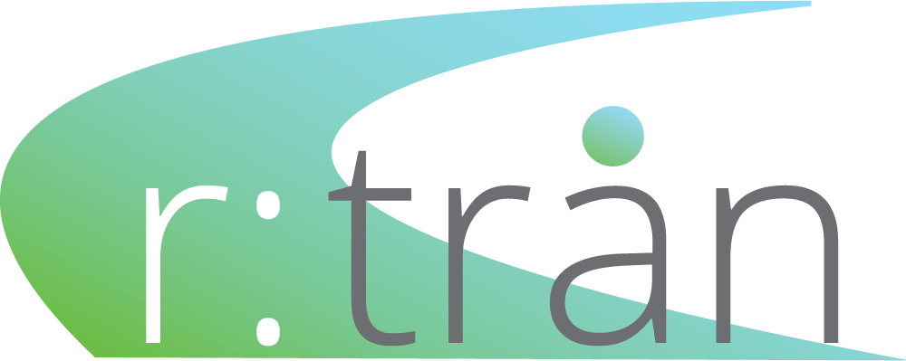
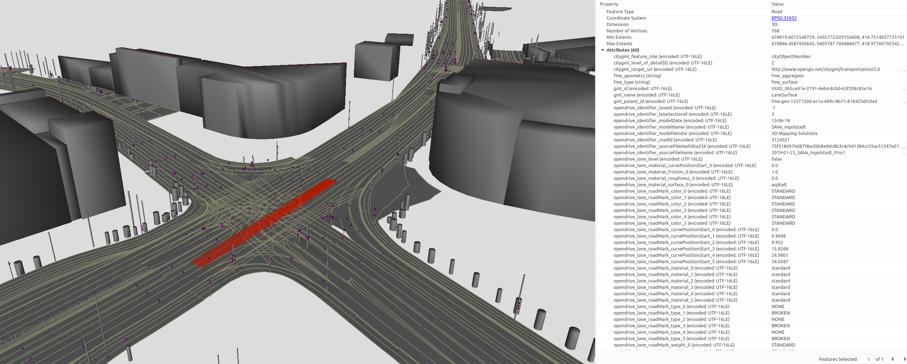

<p align="center"><a href="https://rtron.io" target="_blank" rel="noopener noreferrer"></a></p>

<p align="center">
    <em>a road space model transformer library for OpenDRIVE, CityGML and beyond</em>
    <br />
    <a href="https://rtron.io">View Demos</a>
    ·
    <a href="https://github.com/tum-gis/rtron/issues">Report Bug</a>
    ·
    <a href="https://github.com/tum-gis/rtron/issues">Request Feature</a>
</p>

<p align="center">
    <a href="https://search.maven.org/search?q=io.rtron" title="Latest Release"></a>
    <a href="https://github.com/tum-gis/rtron/actions" title="Build Status"></a>
    <a href="https://github.com/tum-gis/rtron/issues" title="Open Issues"></a>
    <a title="Language"></a>
    <a href="./LICENSE" title="License"></a>
</p>



r:trån reads road network models in [OpenDRIVE](https://www.asam.net/standards/detail/opendrive) and transforms them to the virtual 3D city model standard [CityGML](https://www.opengeospatial.org/standards/citygml).

This enables you to

* [inspect](https://rtron.io/demos/model-inspection) your spatio-semantic road space models
* conduct further [model transformations](https://rtron.io/demos/model-transformations) with tools like [FME](https://www.safe.com/fme/)
* perform geospatial analyses on the [3D City Database](https://rtron.io/demos/3dcitydb)
* deploy [virtual globes](https://rtron.io/demos/web-map)
* load your models into a [desktop GIS](https://rtron.io/demos/desktop-gis)
* [compare and validate](https://rtron.io/demos/model-validation) your models with models from other data sources

## :inbox_tray: Datasets 

Download some sample OpenDRIVE datasets of the city of Ingolstadt from the company [3D Mapping Solutions](https://www.3d-mapping.de/en/customer-area/demo-data) (initial registration required).
Additionally, [awesome-openx](https://github.com/b-schwab/awesome-openx#datasets) provides a list of further OpenDRIVE datasets.

## :rocket: Usage

There are three main variants of usage:

* edit the behaviour and execute the run scripts
* deploy the resulting run scripts (via kscript directly or docker)
* use r:trån as a library for your own project
  
### :gear: Edit and execute the run scripts

Clone the repository:

```bash
git clone https://github.com/tum-gis/rtron.git
```

Actually, you can customize the run scripts of r:trån with all editors, but an IDE provides convenient suggestions and autocompletion.
Thus, install the community edition of [IntelliJ](https://www.jetbrains.com/idea/download) and open the cloned r:trån project.
Navigate to the script [rtron-main/src/main/resources/scripts/convert-opendrive-to-citygml2-simple.kts](rtron-main/src/main/resources/scripts/convert-opendrive-to-citygml2-simple.kts) and execute it by hitting `Menu` ➔ `Run` ➔ `Run…` (or Alt+Shift+F10):

```kotlin
import io.rtron.main.project.processAllFiles
import io.rtron.readerwriter.citygml.CitygmlVersion

/**
 * This function iterates over all files contained in the input directory that have the
 * extension "xodr".
 */
processAllFiles(
    inInputDirectory = "/path/to/input-datasets", // TODO: adjust path
    withExtension = "xodr",
    toOutputDirectory = "/path/to/output-datasets" // TODO: adjust path
)
{
    // Within this block the transformations can be defined by the user. For example:

    // 1. Read the OpenDRIVE dataset into memory:
    val opendriveModel = readOpendriveModel(inputFilePath)

    // 2. Transform the OpenDRIVE model to an intermediary representation (the RoadSpaces model):
    val roadspacesModel = transformOpendrive2Roadspaces(opendriveModel) {
        // Within this blocks, the transformation is parametrized:

        // EPSG code of the coordinate reference system (needed by GIS applications)
        crsEpsg = 32632
    }

    // 3. Transform the RoadSpaces model to a CityGML model:
    val citygmlModel = transformRoadspaces2Citygml(roadspacesModel) {
        // true, if nested attribute lists shall be flattened out
        flattenGenericAttributeSets = true

        // distance between each discretization step for curves and surfaces
        discretizationStepSize = 0.5
    }

    // 4. Write the CityGML model to the output directory:
    writeCitygmlModel(citygmlModel) {

        // set the CityGML versions for writing
        versions = setOf(CitygmlVersion.V2_0)
    }
}
```

After the execution is completed, the directory ``/path/to/output-datasets`` should contain the converted CityGML2 datasets.
For more details, visit the [website](https://rtron.io/wiki/edit-and-execute-the-run-scripts).

### :package: Deploy the run scripts via kscript

In order to run the r:trån scripts in deployment environments, [kscript](https://github.com/holgerbrandl/kscript) needs to be installed.
kscript provides enhanced scripting support for Kotlin and is capable of executing the *.kts scripts contained in this [directory](rtron-main/src/main/resources/scripts).

[sdkman](https://sdkman.io/install) is a tool for managing software development kits and conveniently installs [kotlin](https://kotlinlang.org/) and [kscript](https://github.com/holgerbrandl/kscript#installation):
```bash
curl -s "https://get.sdkman.io" | bash     # install sdkman
source "$HOME/.sdkman/bin/sdkman-init.sh"  # add sdkman to PATH

sdk install java # install java
sdk install kotlin # install Kotlin
sdk install kscript # install kscript
```
If you are on Windows, the deployment via docker is recommended.

Once the environment is ready, the r:trån scripts can be executed: 
```bash
# download the script ...
curl https://raw.githubusercontent.com/tum-gis/rtron/main/rtron-main/src/main/resources/scripts/convert-opendrive-to-citygml2-simple.kts --output convert-opendrive-to-citygml2-simple.kts

# and simply execute it (dependencies are resolved automatically)
kscript ./convert-opendrive-to-citygml2-simple.kts
```

### :whale: Deploy the run scripts via docker

With a [docker installation](https://docs.docker.com/get-docker/), the run scripts can be executed using the [r:trån container](https://hub.docker.com/r/rtron/rtron).
Adjust ``/adjust/path/...`` to your host system's paths and execute the following command: 
```bash
docker run -v /adjust/path/to/input-datasets:/project/input \
           -v /adjust/path/to/output-datasets:/project/output \
           -i rtron/rtron - < /adjust/path/to/convert-opendrive-to-citygml2-simple.kts
```
Also note that the script must now reference paths in the container file system (``/project/input``, ``/project/output``).


### :recycle: Use r:trån as library (experimental)

r:trån is a collection of software components for spatio-semantic road space models, as described in the [architecture](https://rtron.io/architecture/).
To use its functionality in another Kotlin or Java project, add the dependency to the respective component using Gradle:

```gradle
dependencies {
  implementation("io.rtron:rtron-main:1.2.0")
  implementation("io.rtron:rtron-readerwriter:1.2.0")
}
```

To add a dependency using Maven:
```xml
<dependency>
  <groupId>io.rtron</groupId>
  <artifactId>rtron-main</artifactId>
  <version>1.2.0</version>
</dependency>
```


## :hammer_and_wrench: Contributing

r:trån was developed so that everyone can benefit from spatio-semantic road space models.
Therefore, bug fixes, issue reports and contributions are greatly appreciated.

## :mortar_board: Research

If you are interested in the concepts and a first application of r:trån, have a look at our [paper](https://doi.org/10.3390/su12093799).
Based on the consistent models now available in OpenDRIVE and CityGML, we generate several target formats for setting up a distributed environment simulation.

```plain
@article{SchwabBeilKolbe2020,
  title = {Spatio-Semantic Road Space Modeling for Vehicle{\textendash}Pedestrian Simulation to Test Automated Driving Systems},
  author = {Benedikt Schwab and Christof Beil and Thomas H. Kolbe},
  journal = {Sustainability},
  year = {2020},
  month = may,
  volume = {12},
  number = {9},
  pages = {3799},
  publisher = {MDPI},
  doi = {10.3390/su12093799},
  url = {https://doi.org/10.3390/su12093799}
}
```

Moreover, these papers may also be of interest:

* [Detailed Streetspace Modelling for Multiple Applications: Discussions on the Proposed CityGML 3.0 Transportation Model](https://doi.org/https://doi.org/10.3390/ijgi9100603)
* [Requirement Analysis of 3D Road Space Models for Automated Driving](https://doi.org/10.5194/isprs-annals-IV-4-W8-99-2019)
* [CityGML and the streets of New York - A proposal for detailed street space modelling](https://doi.org/10.5194/isprs-annals-IV-4-W5-9-2017)

## :memo: License

r:trån is distributed under the Apache License 2.0. See [LICENSE](LICENSE) for more information.

## :handshake: Thanks

* [AUDI AG](https://github.com/audi) for providing an awesome work environment within [SAVe:](https://save-in.digital)
* Prof. [Thomas H. Kolbe](https://www.lrg.tum.de/en/gis/our-team/staff/prof-thomas-h-kolbe/), [Bruno Willenborg](https://www.lrg.tum.de/en/gis/our-team/staff/bruno-willenborg/) and [Christof Beil](https://www.lrg.tum.de/en/gis/our-team/staff/christof-beil/) for support and feedback
* [Claus Nagel](https://github.com/clausnagel) for [citygml4j](https://github.com/citygml4j/citygml4j)
* [JetBrains](https://github.com/JetBrains) for Kotlin and their top-notch IDEs
